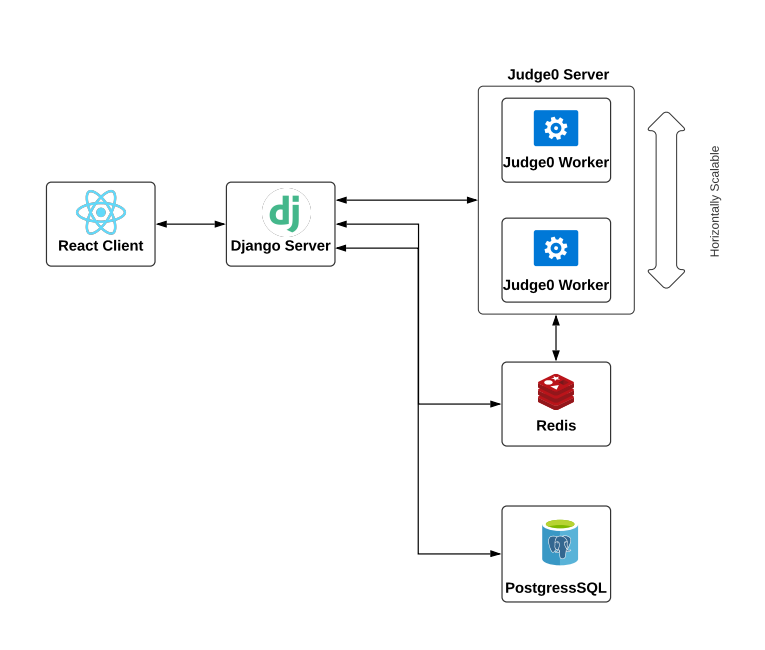

# Online Judge API

[](https://www.codefactor.io/repository/github/pict-acm-student-chapter/oj_api)
[](https://github.com/PICT-ACM-Student-Chapter/OJ_API/actions)

🔥 Online Judge Platform of PICT ACM Student Chapter

## System Architecture




## Prerequisites
This project is built on top of docker containers. 
So ensure that you have Docker and Docker Compose installed on your system
For installation instructions refer: https://docs.docker.com/install/

To run test cases:
```bash
docker-compose run app sh -c "python manage.py test && flake8"
```

## Starting the Server

Start the PostgreSQL server first:
```bash
docker-compose up db
```
Then start whole project:
```bash
docker-compose up
```

## Execute Commands

To execute any commands inside django docker container, follow this format:

```
docker-compose run app sh -c "command here"
```

### Examples

* Create Super User: 

    `docker-compose run app sh -c "python manage.py create superuser"`
* Add New App: 

    `docker-compose run app sh -c "python manage.py startapp polls"`

## API Documentation
API documentation is done using swagger
visit `/swagger` for API documentation 
